# Database Design - خلّيها ترند

## 1. المبادئ

- PostgreSQL هو مصدر الحقيقة.
- Prisma ORM مع migrations واضحة.
- UUID أو CUID آمن لكل الكيانات العامة.
- لا تستخدم JSON بدل العلاقات الأساسية.
- استخدم JSON فقط للـmetadata أو raw provider payload عند وجود سبب واضح.
- كل الجداول المهمة تحتوي `createdAt` و`updatedAt`.
- Soft deletion فقط عندما يحتاج العمل أو التدقيق لذلك.
- الفهارس ضرورية لكل lookup متكرر أو علاقة مالية أو حالة مراجعة.

## 2. الموديلات المقترحة

### المستخدمون والصلاحيات

- User
- UserRole
- UserSessionMetadata
- CreatorProfile
- CreatorPortfolioItem
- UserFollow
- CommunityPost
- CommunityPostImage
- CommunityComment
- CommunityLike
- CommunitySave
- CommunityShare
- CommunityReport
- UserBlock
- UserMute
- UserPrivacySettings
- BrandProfile
- BrandMember
- BrandVerification

### الحسابات الاجتماعية

- SocialAccount
- SocialAccountVerification
- SocialAccountRiskFlag

### الحملات

- Category
- Campaign
- CampaignPlatformRate
- CampaignRequirement
- CampaignAsset
- CampaignTermsSnapshot
- CampaignMembership

### الإرسالات والمراجعات

- Submission
- SubmissionReview
- SubmissionRevisionRequest

### الإحصائيات

- MetricsSnapshot
- ViewAdjustment
- FraudSignal
- FraudAssessment
- TrustScoreEvent

### المال

- FinancialAccount
- LedgerTransaction
- LedgerEntry
- Wallet
- Deposit
- CampaignBudgetReservation
- EarningAccrual
- PayoutMethod
- PayoutRequest

### النزاعات والإشعارات والإدارة

- Dispute
- DisputeMessage
- Notification
- NotificationPreference
- AuditLog
- PlatformSetting
- FeatureFlag

## 3. Enums أساسية

```text
UserRole: SUPER_ADMIN, ADMIN, BRAND, CREATOR
UserStatus: ACTIVE, SUSPENDED, BANNED, PENDING_VERIFICATION
CampaignStatus: DRAFT, PENDING_REVIEW, NEEDS_CHANGES, PENDING_FUNDING, SCHEDULED, ACTIVE, PAUSED, BUDGET_LOW, BUDGET_EXHAUSTED, COMPLETED, CANCELLED, REJECTED, ARCHIVED
SubmissionStatus: DRAFT, SUBMITTED, AUTOMATED_CHECK, UNDER_REVIEW, REVISION_REQUESTED, APPROVED, REJECTED, FLAGGED, EARNING, PAYOUT_HOLD, COMPLETED, REMOVED, DISPUTED
MetricSource: API, MANUAL_ADMIN, CREATOR_EVIDENCE
EarningStatus: ESTIMATED, PENDING_VERIFICATION, HELD, AVAILABLE, PAID, REVERSED
DepositStatus: DRAFT, SUBMITTED, UNDER_REVIEW, APPROVED, REJECTED, CANCELLED
PayoutStatus: DRAFT, SUBMITTED, UNDER_REVIEW, APPROVED, PROCESSING, PAID, REJECTED, CANCELLED, FAILED, REVERSED
DisputeStatus: OPEN, AWAITING_CREATOR, AWAITING_BRAND, UNDER_ADMIN_REVIEW, RESOLVED_CREATOR, RESOLVED_BRAND, PARTIAL_RESOLUTION, CLOSED
Platform: TIKTOK, INSTAGRAM, FACEBOOK, YOUTUBE
Currency: IQD, USD
```

## 4. علاقات حرجة

- User له CreatorProfile أو BrandMember/BrandProfile حسب الدور.
- BrandProfile يملك Campaigns.
- Campaign يملك PlatformRates وRequirements وAssets.
- CampaignMembership يربط CreatorProfile مع Campaign ويحفظ CampaignTermsSnapshot.
- CreatorPortfolioItem يرتبط بملف صانع واحد ويحفظ رابط منشور مطبّعاً وصورة غلاف وترتيب العرض.
- Submission يرتبط بـCampaignMembership وSocialAccount.
- MetricsSnapshot يرتبط بـSubmission ولا يعدل بعد الإنشاء.
- EarningAccrual يرتبط بـSubmission وMetricsSnapshot.
- LedgerTransaction تحتوي LedgerEntries متوازنة.
- Wallet ترتبط بـUser وFinancialAccount.
- PayoutRequest يحجز مبلغاً من Wallet عبر Ledger.
- AuditLog يرتبط بالمستخدم المنفذ والكيان المتأثر.

## 5. قيود وفهارس

### قيود uniqueness

- `User.email` unique عند وجوده.
- `User.phone` unique عند وجوده.
- `SocialAccount.platform + platformUserId` unique.
- `CreatorPortfolioItem.creatorProfileId + projectUrl` unique.
- `Submission.platform + platformPostId` unique.
- `CampaignMembership.campaignId + creatorProfileId` unique عند عدم السماح بأكثر من انضمام.
- `LedgerTransaction.idempotencyKey` unique.
- `PayoutRequest.idempotencyKey` unique.

### فهارس

- Campaign status/start/end/category.
- Submission status/campaign/platform.
- MetricsSnapshot submission/capturedAt.
- LedgerEntry account/createdAt.
- AuditLog actor/target/createdAt.
- Notification user/read/createdAt.
- Dispute status/createdAt.

## 6. تصميم Ledger

التصميم المقترح Double-entry:

- `FinancialAccount`: حساب مالي منطقي، مثل محفظة صانع محتوى، ميزانية حملة، إيرادات المنصة، حساب سحب معلق.
- `LedgerTransaction`: العملية المالية على مستوى الأعمال.
- `LedgerEntry`: debit/credit entry لكل حساب.

كل `LedgerTransaction` يجب أن تكون متوازنة لكل عملة:

```text
sum(debits) == sum(credits)
```

لا تحذف الحركات المالية. أي تصحيح يتم عبر reversal transaction.

## 7. ERD مبدئي

```mermaid
erDiagram
  User ||--o| CreatorProfile : has
  User ||--o{ UserFollow : follows
  User ||--o{ UserFollow : followed_by
  User ||--o{ CommunityPost : publishes
  CommunityPost ||--o{ CommunityPostImage : contains
  CommunityPost ||--o{ CommunityComment : receives
  CommunityComment ||--o{ CommunityComment : replies
  CommunityPost ||--o{ CommunityLike : receives
  CommunityPost ||--o{ CommunitySave : saved_as
  CommunityPost ||--o{ CommunityShare : shared_as
  CommunityPost ||--o{ CommunityReport : reported_in
  User ||--o{ UserBlock : controls
  User ||--o{ UserMute : controls
  User ||--o{ BrandMember : joins
  BrandProfile ||--o{ BrandMember : has
  BrandProfile ||--o{ Campaign : owns
  Campaign ||--o{ CampaignPlatformRate : has
  Campaign ||--o{ CampaignRequirement : has
  Campaign ||--o{ CampaignAsset : has
  Campaign ||--o{ CampaignMembership : receives
  CreatorProfile ||--o{ CampaignMembership : joins
  CreatorProfile ||--o{ CreatorPortfolioItem : showcases
  CampaignMembership ||--|| CampaignTermsSnapshot : stores
  CampaignMembership ||--o{ Submission : creates
  Campaign ||--o{ Conversation : scopes
  CreatorProfile ||--o{ Conversation : participates
  Conversation ||--o{ ConversationMessage : contains
  Conversation ||--o{ ConversationReport : receives
  SocialAccount ||--o{ Submission : used_by
  Submission ||--o{ MetricsSnapshot : records
  Submission ||--o{ EarningAccrual : earns
  User ||--o{ Wallet : owns
  Wallet ||--|| FinancialAccount : maps_to
  LedgerTransaction ||--o{ LedgerEntry : contains
  FinancialAccount ||--o{ LedgerEntry : posts
  User ||--o{ PayoutMethod : owns
  User ||--o{ PayoutRequest : requests
  Submission ||--o{ Dispute : may_have
  User ||--o{ Notification : receives
  User ||--o{ AuditLog : acts
```



## 8. Prisma model sketch

هذا sketch وليس schema نهائي:

```prisma
model User {
  id        String   @id @default(cuid())
  email     String?  @unique
  phone     String?  @unique
  fullName  String
  status    UserStatus @default(PENDING_VERIFICATION)
  createdAt DateTime @default(now())
  updatedAt DateTime @updatedAt
}

model Campaign {
  id             String @id @default(cuid())
  brandId        String
  title          String
  status         CampaignStatus @default(DRAFT)
  currency       Currency @default(IQD)
  totalBudget    BigInt
  reservedBudget BigInt @default(0)
  startsAt       DateTime?
  endsAt         DateTime?
  createdAt      DateTime @default(now())
  updatedAt      DateTime @updatedAt
}

model LedgerTransaction {
  id             String @id @default(cuid())
  idempotencyKey String @unique
  type           String
  currency       Currency
  status         String
  description    String?
  createdAt      DateTime @default(now())
}

model LedgerEntry {
  id            String @id @default(cuid())
  transactionId String
  accountId     String
  direction     LedgerDirection
  amount         BigInt
  createdAt      DateTime @default(now())
}
```

## 9. أسئلة تؤجل للتنفيذ

- هل نعتمد Supabase Auth مباشرة أم Auth.js مع Supabase Postgres؟
- هل الحسابات المالية تستخدم حساباً لكل campaign reservation أم subaccount منطقي؟
- هل نحتاج Maker-Checker من MVP أم نجهزه كبنية فقط؟
